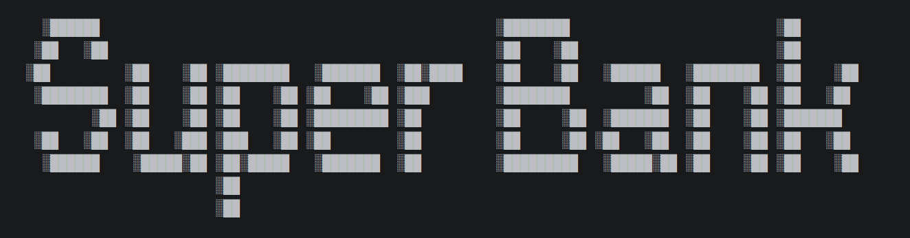
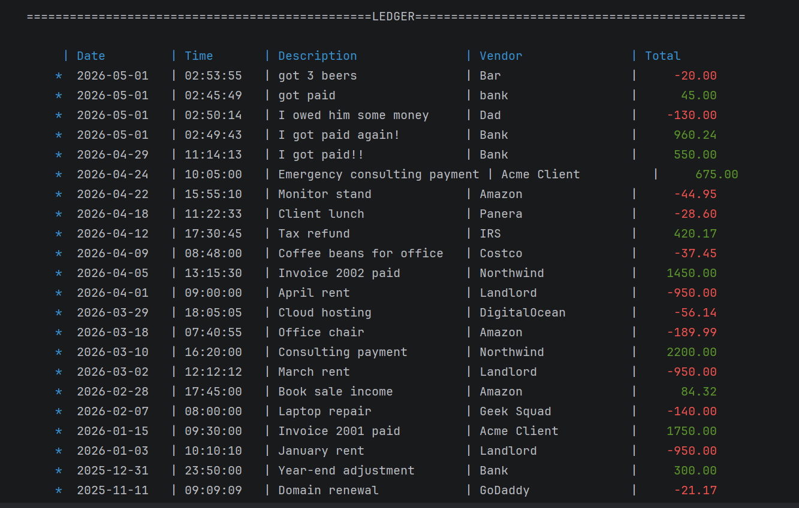
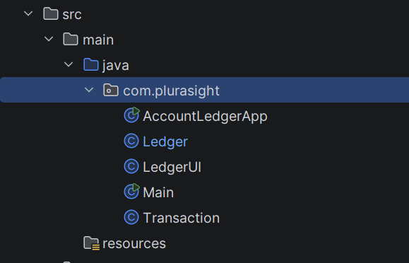
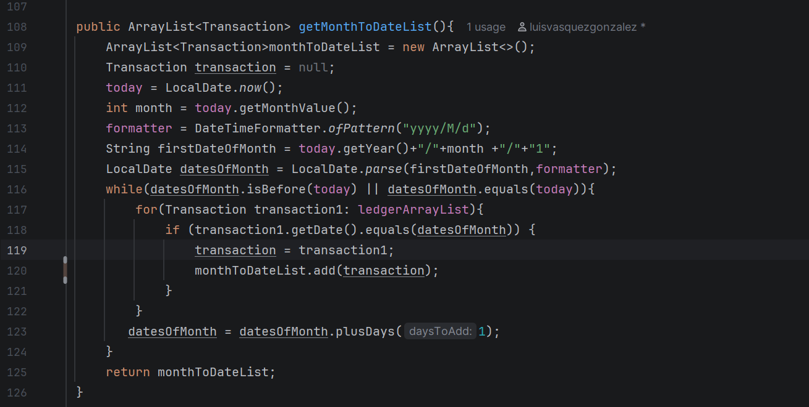

# Welcome to Super Bank

**Super Bank** is a robust Java-based command-line application designed to help users track and manage their financial activity. The application provides a simple and organized interface for recording deposits, tracking payments, scheduling future transactions, and generating detailed financial reports.

## Why Super Bank?

Super Bank includes a reliable set of features that make financial tracking easier and more organized:

- Clean and user-friendly command-line interface
- Track deposits and payments
- Schedule future deposits and payments
- Generate detailed financial reports
- Search transactions using a robust search system
- Filter transactions by date, vendor, description, time, or amount

# Developing Super Bank

For this project, I used an **object-oriented programming approach** instead of placing most of the functionality into one file. I separated the application into four main classes, each with a specific responsibility:

## Main Classes

### `AccountLedgerApp.java`

This class contains the `main` method and serves as the starting point of the application. It is responsible for handling the main program logic, user input, and user interactions. This class also connects the other classes and allows them to work together.

### `Ledger.java`

This class handles most of the application’s core functionality. It is responsible for adding, retrieving, loading, and saving transaction data from a file. Its main purpose is to store all transactions and make them accessible to the rest of the application.

### `LedgerUI.java`

This class is responsible for the user interface. It controls what is displayed on the screen, including colors, menus, prompts, and user options. Its main purpose is to improve the user experience and keep the interface organized.

### `Transaction.java`

This class represents a single transaction. It stores important transaction details such as the date, time, vendor, description, amount, and transaction type, whether it is a payment or a deposit.

## My Favorite Code Block

My favorite code block is the `getMonthToDateList()` method from the `Ledger.java` class.

This method retrieves all transactions from the beginning of the current month up to the current date. Although this may sound simple at first, implementing this feature required the use of several important programming concepts.

To complete this method, I had to apply my knowledge of:

- Data structures, such as `ArrayList`
- Loops, such as `for` loops and `while` loops
- Conditional statements
- Date and time classes
- Methods and return values
- Problem-solving logic

This is my favorite part of the project because it combines many of the core programming concepts we covered in class. It challenged me to think carefully about how to organize data, compare dates, and return accurate results to the user.

## Challenges and Solutions

One of the biggest challenges I faced during this project was planning. At times, I started writing code before fully mapping out the best way to solve the problem. This caused me to rewrite and restructure parts of my code later in the project, which made the process more difficult and time-consuming.

Through this experience, I learned the importance of planning before coding. Creating a clear structure before writing the program helps reduce confusion, prevents unnecessary rewrites, and makes the development process more efficient.

Another challenge I faced was remembering certain Java concepts and syntax. Programming includes many details, and some concepts can be difficult to remember right away. For example, I had to review topics such as `BufferedWriter`, `BufferedReader`, and `String.format()` to make sure I was using them correctly.

To overcome this, I used my study guide in Brightspace and reviewed examples from class. This helped me better understand the material and apply it correctly in my project.

Overall, building Super Bank helped me strengthen my understanding of object-oriented programming, file handling, user input, data structures, and problem-solving in Java.

